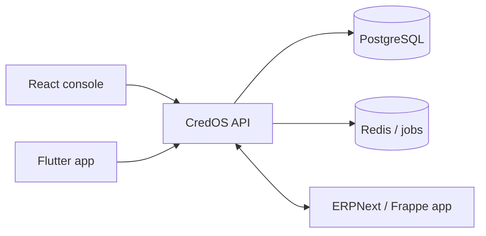

# Architecture

CredOS is organised as a domain-oriented monorepo. The API is the system of record; Frappe is an integration boundary for ERP workflows, not a competing source of truth.

## Tenant and data isolation

Every business record is scoped to a `companyId`. The authenticated actor's tenant is derived server-side; it is never accepted as a client-selected authorization boundary. The persistence implementation must enforce this scope in every query and use database row-level security for production deployments.

## Sprint 1 modules

- **Identity:** password verification and signed access tokens.
- **Companies:** tenant profile and operational settings.
- **Customers:** credit limit, contact, and lifecycle management.
- **Invoices:** issue, outstanding-balance, and status computation.
- **Payments:** allocation to invoices; allocations cannot exceed outstanding balance.
- **Dashboard:** aggregate receivables and collection indicators.

## Production hardening backlog

Replace the development in-memory repository with Postgres migrations, add refresh-token rotation, Argon2id hashing, rate limiting, an outbox/event bus, audit log, object storage, observability, backups, and secret management before handling live financial data.

The database skeleton includes the outbox and the core storage boundaries for communications, risk, trust, reporting, and integrations. Workers and provider adapters are intentionally not enabled until their credentials, idempotency handling, and compliance reviews are in place.
